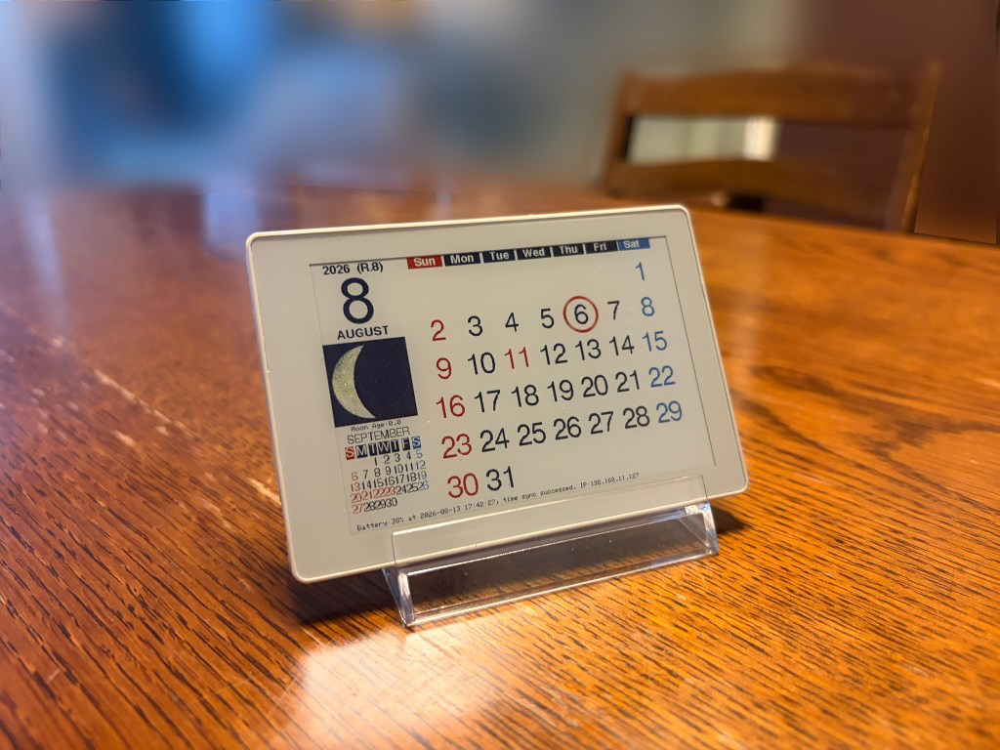
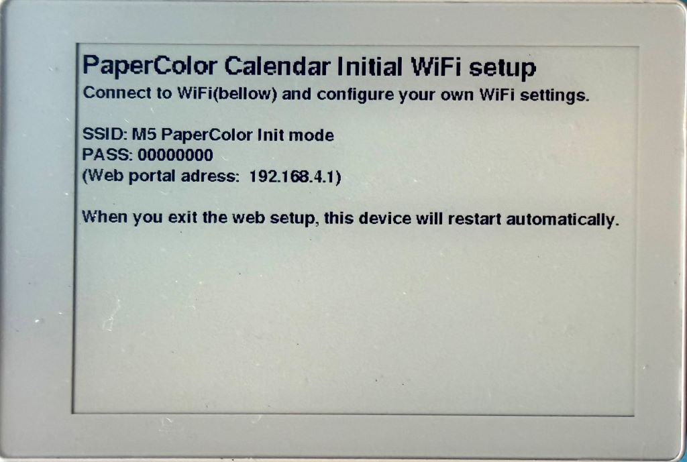
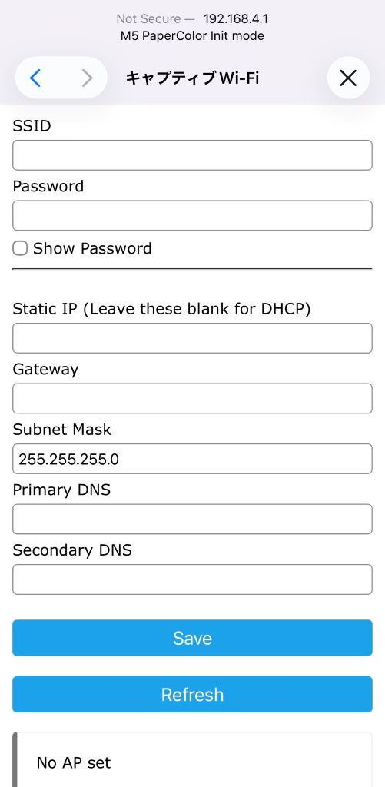
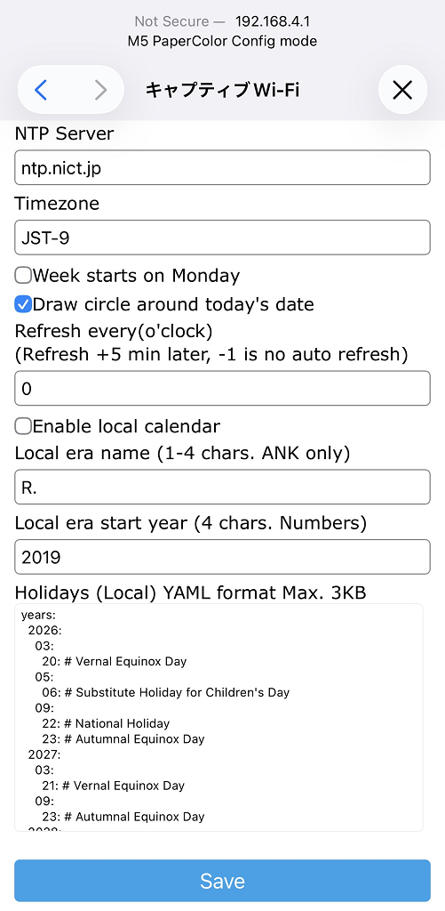

# M5 PaperColor Calendar

([日本語](README_JP.md))

### 1. Overview
This project is a simple desktop perpetual calendar for the `M5 PaperColor`.  
It’s basically the first idea anyone gets when seeing a color e‑paper device — so I just built it.
To make the firmware easy to install through [`M5Burner`](https://docs.m5stack.com/en/uiflow/m5burner/intro), it doesn’t rely on any external files.  
All configuration is done from a WiFi‑enabled device like your mobile phone.
Since it’s a calendar, it only wakes up for about five minutes a day, hoping the battery will last a long time

### 2. Requirements
Besides the `M5 PaperColor` (referred to as “the device” below), you only need:

- A computer to flash the firmware  
- A mobile phone for configuration  

No SD card is required. All settings are stored in internal flash (NVS).

### 3. Installation
The easiest way is to use [`M5Burner`](https://docs.m5stack.com/en/uiflow/m5burner/intro) and select Download -> Burn.

If you prefer `esptool.py`, `M5Launcher` or `UIFlow`, binary ZIP files are available in the repository’s [`Releases`](../../releases) section in the right side.  

### 4. First Boot (WiFi Setup)

**4‑1.** On first boot, the device shows a simple WiFi setup screen.  
Connect to SSID: `M5 PaperColor Init mode` from your mobile phone.  
Password is `00000000` (eight zeros).(**Security is intentionally minimal this, so please use it with caution.**)  
   
 

**4‑2.** After your mobile phone connects, a captive portal will appear.  
Tap `Configure WiFi`, enter your own WiFi `SSID` and `password`, and fill in `static IP` fields only if needed. (Leave them blank for `DHCP`.)  
**4‑3.** Press `Save`, wait a moment, and the device will store the settings and reboot.
   
**4‑4.** After the long e‑paper initialization, it fetches the current time via NTP and displays the calendar for the current month.

### 5. Usage
- When running on battery(unplugged) and left untouched for 5 minutes, the device turns power off (unless disabled).  
- At the configured time (default: 00:05 AM), the device automatically reboots, fetches NTP time, updates the calendar, and goes back to power off after 5 minutes.  
- During sleep (normally 23h 55m per day), pressing the top-left button briefly will reboot(not `resume`) the device. When the green 🟢 LED starts blinking, it’s ready.
- While the top-right LED is blinking green 🟢 (or red), you can:

  - Button C: Fetch NTP and refresh the display  
  - Button A: Show next month (no NTP)  
  - Button B: Show previous month (no NTP)  
  - Top-left button: Hardware power button (standard behavior)
  
  **Special operations:**
  
  - Button A **hold 3 sec**: Enter Config Mode (blue 🔵 LED blinking)  
  - Button B **hold 3 sec:** **[WARNING]** **Erase all** WiFi settings and reboot  
  
  
  
  
  

<small>(from <a href="https://docs.m5stack.com/en/arduino/papercolor/button">m5docs</a>)</small>
  
   
  
### 6. Config Mode

When button A is held 3 sec and released, enter Config Mode. (🔵 blue LED blinking),

**6‑1.** Connect to SSID: `M5 PaperColor Config mode` from your mobile phone.  
Password is the same as Init mode.
**6‑2.** Tap Setup to open the configuration screen.
**6‑3.** Adjust settings as needed.  
Enabling Local calendar reveals additional options.
**6‑4.** Press Save (it may take a moment). When “Saved” appears, close the screen with the × button.
**6‑5.** The device redraws the current month’s calendar.
**6‑6.** **Important:** After finishing configuration, **hold Button A for 3 seconds again** to exit Config Mode.  
The device cannot enter sleep mode while in Config Mode, which drains the battery.
 

+ **About Holidays**  
  + Holiday data is written in YAML (indent with 2 or 4 spaces). Only the Keys are used, the Values(after '\:') are not used.  
  + `years`: the date varies from year to year holidays(equinoxes, etc.). Of course, you’re welcome to add your own vacation days!  
  + `year-common`: holidays shared across all years  
  + Rules like `3rd-mon` are supported  
  + Comments start with `#` (You don't need to have those.)
  + Max size is about 3 KB. Preparing the YAML on a PC and copy/pasting it from your mobile phone is the most practical approach.

### 7. Notes
- While running(in non-sleep mode), the top-right LED blinks short 🟢 Green every 5 seconds. During NTP retrieval or configuration, the bottom-right LED blinks 🔵 Blue every second.  
- While running(in non-sleep mode), if the battery drops below roughly 20%, the top-right LED switches to 🔴 Red blinking, indicating that you should charge the device. Then it reaches about 25%, it will return to 🟢 Green blinking. Full charging from 0% takes around 3 hours.  
- Leaving sleep mode always triggers a reboot, not resume. This is due to the hardware and the M5Unified library.  
- Battery level is approximate and not updated during sleep(Because the power is off). Also, the battery warning icon that appears in the lower-right corner of the screen is **based on the battery status at the time the screen was rendered**, so it will **not update even after charging unless the screen is redrawn**. This is also due to the specifications of the device's hardware and the `M5Unified` library.
- After all, perhaps because the device was just released, there are currently many issues—such as problems with library support. In particular, there are still many unknowns regarding power-related functions, including the power button, so please try out various related operations to see what works.
- Moon phase display is approximate. Since making it any more accurate would require detailed orbital calculations and similar processing, I haven't implemented it with that level of precision.  
- Probably you know, E‑paper initialization is very slow — wait patiently until the device plays a short C‑G‑E tone chime.  
- Weekday and month names cannot be changed and I have no plans to make that possible. Modify the source and build your own binaly if needed. (Open source is awesome!)

### 8. License
This software is released under the [MIT License](LICENSE.txt).  
Library components follow their respective licenses.

### 9. Development Environment & Libraries
VSCode + PlatformIO

- m5stack/M5Unified  
- tzapu/WiFiManager  
- tobozo/YAMLDuino  
- adafruit/Adafruit NeoPixel  

### 10. Disclaimer
AUTHOR BE LIABLE FOR ANY CLAIM, DAMAGES OR OTHER LIABILITY, WHETHER IN AN ACTION OF CONTRACT, TORT OR OTHERWISE, ARISING FROM, OUT OF OR IN CONNECTION WITH THE SOFTWARE OR THE USE OR OTHER DEALINGS IN THE SOFTWARE.

### 11. Author
[osamusg](https://github.com/osamusg)